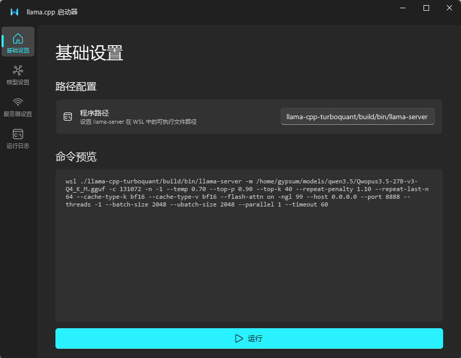
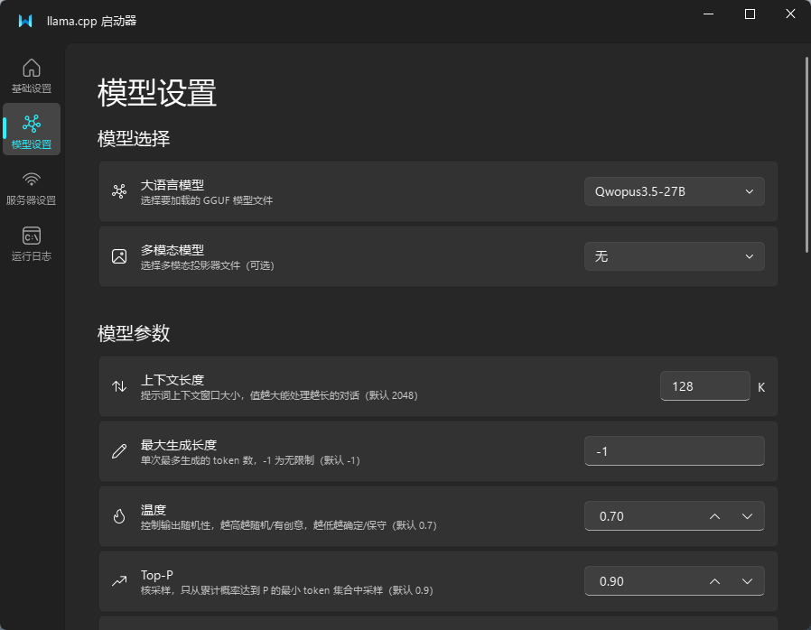
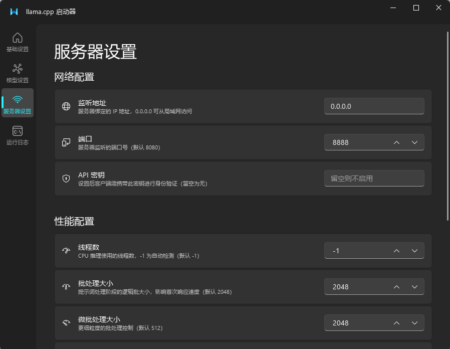
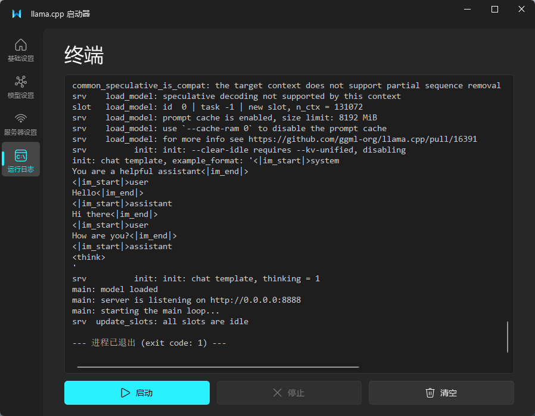

# 作者的话
本项目代码和文档99.9%由AI生成，作者不怎么会python，有问题就问AI吧。  

--- 

# llama.cpp Launcher

一个基于 PySide6 + Fluent Design 的 llama.cpp 服务端图形化启动器，用于在 Windows 上通过 WSL 快速配置和启动 `llama-server`。

## 功能特性

- **可视化参数配置** — 通过分页界面配置模型、采样、KV 缓存、GPU 加速、服务器等所有参数，无需手动拼接命令行
- **实时命令预览** — 基础设置页面实时显示最终拼接的完整 WSL 启动命令
- **模型管理** — 通过 `models.csv` 维护模型列表，支持大语言模型和多模态模型的下拉选择
- **内嵌终端** — 运行日志页面直接显示 `llama-server` 的输出，支持启动/停止/清空操作
- **配置持久化** — 所有参数自动保存为 `config.json`，下次启动时自动恢复
- **一键打包** — 支持通过 PyInstaller 打包为独立 `.exe` 文件

## 截图

| 基础设置 | 模型设置 |
|:---:|:---:|
|  |  |

| 服务器设置 | 运行日志 |
|:---:|:---:|
|  |  |

## 环境要求

- Windows 10/11
- [WSL](https://learn.microsoft.com/zh-cn/windows/wsl/install)（已安装并配置好 Linux 发行版）
- WSL 中已编译好的 [llama.cpp](https://github.com/ggerganov/llama.cpp)（需要 `llama-server` 可执行文件）
- Python 3.10+

## 安装

```bash
# 克隆仓库
git clone https://github.com/yourname/llama.cpp.launcher.git
cd llama.cpp.launcher

# 安装依赖
pip install -r requirements.txt
```

## 使用方法

### 1. 配置模型列表

编辑 `models.csv`，按以下格式添加模型：

```csv
m,显示名称,WSL中的模型绝对路径
mm,多模态模型显示名,WSL中的mmproj文件路径
```

示例：

```csv
m,Qwen3.5-27B,/home/user/models/qwen3.5-27b-q4.gguf
mm,Qwen3.5-mmproj,/home/user/models/mmproj-f16.gguf
```

- `m` 表示大语言模型，`mm` 表示多模态投影器
- 路径为 WSL 内的 Linux 路径

### 2. 启动应用

```bash
python llama.cpp.launcher
```

### 3. 配置参数

应用包含四个页面：

| 页面 | 内容 |
|------|------|
| **基础设置** | 程序路径、命令预览、运行按钮 |
| **模型设置** | 模型选择、采样参数、KV 缓存、多模态、GPU 加速 |
| **服务器设置** | 网络配置、性能参数、功能开关 |
| **运行日志** | 终端输出、启动/停止/清空控制 |

### 4. 运行

在基础设置页面确认命令预览无误后，点击底部「运行」按钮即可启动 `llama-server`。

## 打包为 EXE

```bash
pyinstaller llama启动器.spec
```

打包后将 `dist/llama启动器.exe` 与 `models.csv` 放在同一目录下即可使用。

## 支持的 llama-server 参数

<details>
<summary>点击展开完整参数列表</summary>

| 分类 | 参数 | 说明 |
|------|------|------|
| 模型 | `-m` | 模型文件路径 |
| 模型 | `-mm` | 多模态投影器路径 |
| 模型 | `-c` | 上下文长度 |
| 模型 | `-n` | 最大生成长度 |
| 采样 | `--temp` | 温度 |
| 采样 | `--top-p` | Top-P 核采样 |
| 采样 | `--top-k` | Top-K 采样 |
| 采样 | `--repeat-penalty` | 重复惩罚 |
| 采样 | `--repeat-last-n` | 惩罚回溯窗口 |
| 缓存 | `--cache-type-k/v` | K/V 缓存精度 |
| 缓存 | `--cache-ram` | KV 缓存大小 |
| 缓存 | `--flash-attn` | Flash Attention |
| 多模态 | `--image-max-tokens` | 图像最大 Token 数 |
| 多模态 | `--image-min-tokens` | 图像最小 Token 数 |
| GPU | `-ngl` | GPU 卸载层数 |
| GPU | `-mg` | 主 GPU 设备 ID |
| GPU | `-ts` | 张量分割比例 |
| GPU | `--no-mmap` | 禁用内存映射 |
| GPU | `--numa` | NUMA 优化策略 |
| 服务器 | `--host` | 监听地址 |
| 服务器 | `--port` | 端口 |
| 服务器 | `--api-key` | API 密钥 |
| 服务器 | `--threads` | 线程数 |
| 服务器 | `--batch-size` | 批处理大小 |
| 服务器 | `--ubatch-size` | 微批处理大小 |
| 服务器 | `--parallel` | 并行序列数 |
| 服务器 | `--timeout` | 超时时间 |
| 开关 | `--verbose` | 详细输出 |
| 开关 | `--metrics` | 监控指标 |
| 开关 | `--no-webui` | 禁用 Web 界面 |

</details>

## 项目结构

```
llama.cpp.launcher/
├── llama.cpp.launcher    # 主程序
├── models.csv            # 模型配置表
├── config.json           # 运行时自动生成的参数配置（已 gitignore）
├── llama启动器.spec       # PyInstaller 打包配置
├── pics/                 # 截图
├── requirements.txt      # Python 依赖
├── LICENSE
└── README.md
```

## 许可证

[MIT License](LICENSE)
